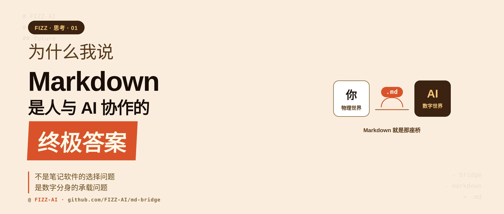
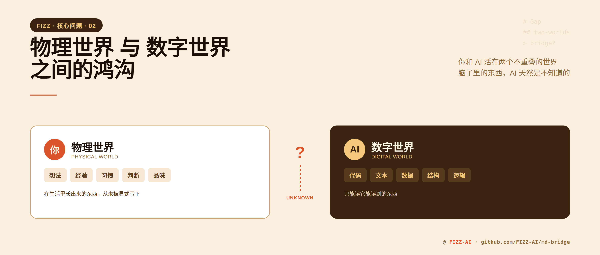
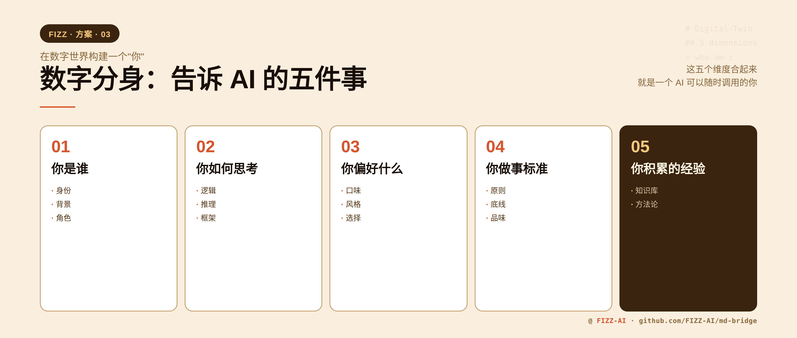
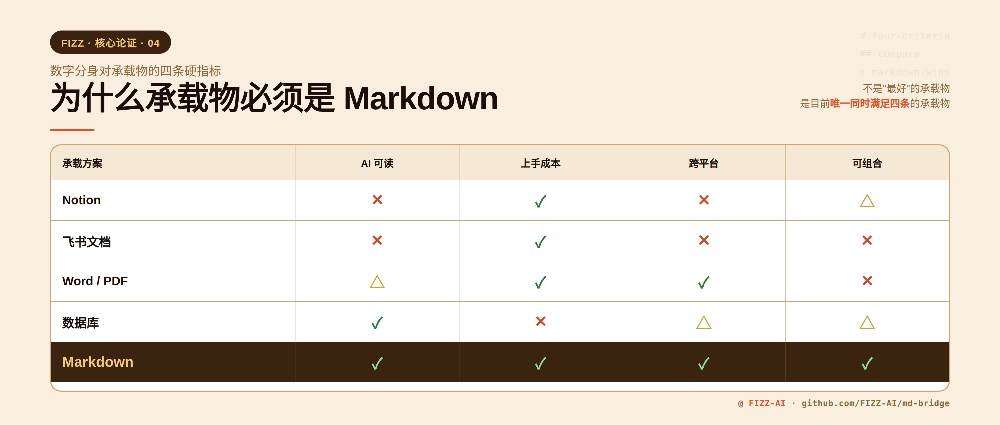
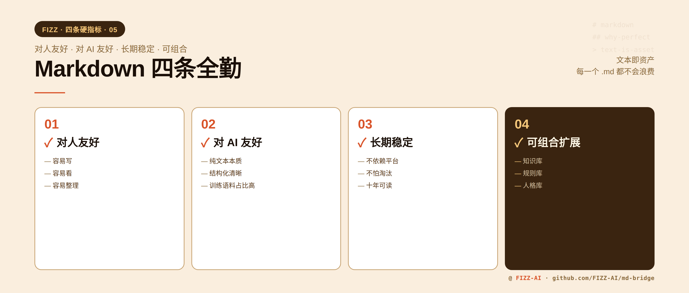
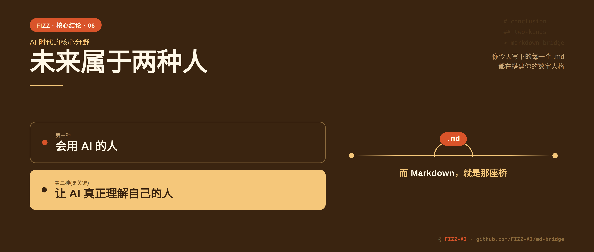
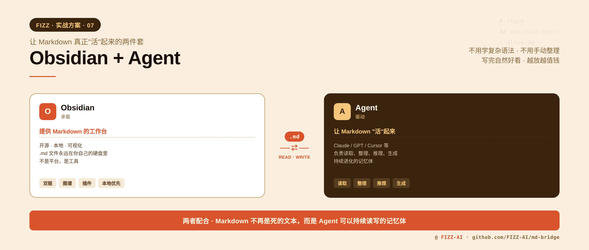

# 为什么 Markdown 是人与 AI 协作的终极答案

最近越来越强烈地意识到一件事：

**未来最强的人，不一定是最努力的人，而是最会和 AI 协作的人。**

但要做到这件事，有一个常常被忽略的前提：你得先让 AI 真正理解你。而真正让这件事能长期运作的关键，其实是一个很多人没注意过的东西：**Markdown**。

## 01 一个观察

过去半年我重度使用 AI 写东西、做分析、处理各种杂活。有一个现象一直在出现：

**同样一个问题，AI 有时能给出让我直呼“就是这个”的答案，有时却是一堆正确但没用的话。**

差别不在模型，也不在当天的状态。真正的差别在于：**那个时刻，AI 对“我是谁”了解得有多深。**

AI 越了解我的背景、判断标准、过往经验，它的回答就越精准、越贴合我的需要；反之则越空泛。

这让我意识到一件事：

**AI 协作的瓶颈，从来不在 AI 那一端，而在“我”有没有被结构化地交付过去。**

## 02 物理世界与数字世界的鸿沟

为什么会这样？本质上是因为，你和 AI 活在两个不重叠的世界里。

你活在物理世界。你的经验是在生活里一点一点长出来的，你的判断是无数次具体决策沉淀下来的。这些东西从未被显式地写下来过，它们就在你脑子里，是你这个人的一部分。

而 AI 活在数字世界。它只能读它能读到的东西：文本、代码、结构化数据。你脑子里的东西，它天然是不知道的。

所以真正高效的协作，只有一条路径：**把“你”这个人，预先结构化地沉淀到数字世界里，让 AI 随时可以直接调用。**

这个沉淀下来的东西，我把它叫做：**数字分身**。

## 03 数字分身：要告诉 AI 的五件事

数字分身不是一个玄学概念。具体来说，它要向 AI 完整交付五个维度的信息：

1. **你是谁**：身份、背景、角色
2. **你如何思考**：逻辑、推理、框架
3. **你偏好什么**：口味、风格、选择
4. **你做事的标准**：原则、底线、品味
5. **你积累的经验**：知识、方法论

这五个维度合起来，就是一个 AI 可以随时调用的“你”。

而且值得强调的是，**这个分身的价值不止于让 AI 更懂你**。未来的 AI 不再是“帮你回答一个问题”那么简单，它会基于这个分身，替你思考、替你执行、替你协作。你越早开始沉淀，这个分身就越早开始为你工作。

## 04 为什么是 Markdown

那问题来了：**什么东西最适合承载这个分身？**

这才是真正值得花篇幅讨论的问题。

要回答它，不能只看 Markdown 好在哪，得先搞清楚**数字分身对承载物的要求是什么**。我总结下来有四条硬指标：

**第一，AI 必须能无损地读懂它。**

这是最底层的要求。分身是给 AI 用的，AI 读不顺的格式一票否决。

我试过把自己的背景、习惯整理成 Notion 数据库。在我这边效率很高，但当我让 AI 读取这些内容时，问题立刻出现：Notion 的 block 结构在导出时会变形，嵌套关系断裂，复杂的数据库变成一堆孤立的片段。AI 面对这种数据，理解成本极高。

飞书文档有类似的问题。你在飞书里写得再漂亮，离开飞书环境，内容就残缺了。

只有**纯文本**，才是 AI 读起来零摩擦的形态。而纯文本里，带有轻量结构的，就是 Markdown。事实上，几乎所有主流 LLM 的训练语料里，Markdown 都占据了相当比例，模型对 `#`、`-`、`**` 这套符号系统天然亲和。读一份结构清晰的 `.md`，和读一段普通文本的理解成本是一样低的。

**第二，它必须足够简单，让你愿意长期写。**

分身是一个需要持续沉淀的东西，不是一次性文档。如果承载方式本身有学习成本，或者写起来费劲，99% 的人会在第二周放弃。

Markdown 的语法简单到什么程度？三个符号就能覆盖绝大多数需求：`#` 做标题、`-` 做列表、`**` 做强调。十分钟上手，一辈子不用升级。

更关键的是：**Markdown 的表达能力刚好踩在甜点上**。比它简单的纯文本没有结构，AI 读起来分不清层次；比它复杂的格式，比如富文本、数据库，写起来太重，你不会坚持。

**第三，它必须能跨越平台和时间。**

你的数字分身是一个长期资产，不能被锁死在任何一个工具里。

这一点 Notion、飞书、Evernote、Apple Notes 全部不及格。不是说这些工具不好，而是它们的数据格式都是平台私有的。一旦平台关停、订阅到期，或者你想换个工具，迁移成本极高，甚至完全迁不出去。

Markdown 是纯文本，存在任何一个文件夹里都是你的。十年后 Notion 可能早就换了三次形态，但一个 `.md` 文件用记事本都能打开。

**第四，它必须是“可组合”的原子。**

这是很多人没意识到的一点，但可能是最关键的。

你的分身不会是一份文档，而是会随着时间长成一个庞大的体系：数百份 `.md` 互相引用、嵌入、链接。今天写的“我的写作偏好”，明天可能被“我的对外沟通风格”引用；一个月后可能有新 `.md` 聚合它们，形成“我的表达系统”。

这种“小文件 + 自由组合”的模式，只有原子化的纯文本能承担。**Notion 的页面嵌套做不到，Word 文档做不到，数据库做不到，只有 Markdown 可以。**

正是因为这一点，你今天写下的每一个 `.md` 都不会浪费。它会在未来某个时刻，被另一个 `.md` 引用、被一个 Agent 调用、被一次新的需求激活。

四条硬指标对照下来：

| 方案 | AI 可读 | 上手成本 | 跨平台 | 可组合 |
|---|---|---|---|---|
| Notion | ❌ | ✅ | ❌ | ⚠️ |
| 飞书文档 | ❌ | ✅ | ❌ | ❌ |
| Word / PDF | ⚠️ | ✅ | ✅ | ❌ |
| 数据库 | ✅ | ❌ | ⚠️ | ⚠️ |
| **Markdown** | ✅ | ✅ | ✅ | ✅ |

**Markdown 不是“最好”的承载物，而是目前唯一同时满足这四条的承载物。**

## 05 每一个 .md 都是你

想清楚这一点之后，我对写 `.md` 这件事的态度发生了根本变化。

过去我写 Markdown，是为了记笔记。记完就存着，十有八九以后也不会翻。

现在我写 `.md`，是在**给数字分身喂食**。

这两件事看起来一样，本质完全不同。前者的价值终止于书写完成的那一刻，后者会在未来被反复调用、引用、激活。

所以你今天写下的每一个 `.md`，不是笔记，也不是备忘录，而是在一块一块地，搭建你的**数字人格**。

## 06 未来属于两种人

顺着这个逻辑往下推，未来的图景大概是这样：

- 🟠 第一种：会用 AI 的人。他们知道怎么用 AI，知道用哪个模型，知道什么场景上什么工具。这已经是一种优势。
- 🟡 第二种，更关键：让 AI 真正理解自己的人。他们不只是会用 AI，他们有一个不断沉淀、持续进化的数字分身，AI 在这个分身的基础上工作，输出质量和自动化程度都是另一个量级。

而 **Markdown，就是这两种人之间的那座桥。**

## 07 但怎么高效地写？

讲到这里，理论部分就结束了。但凡事落到实践，就会遇到新的问题。

在没有 AI 的时代，这套方法其实是跑不通的。四个典型障碍：

- ❌ Markdown 语法虽然简单，但手动组织仍然费神
- ❌ 文件越堆越多，整理起来比写还累
- ❌ 纯文本不够好看，写着写着就没动力
- ❌ 放久了没人翻，最后变成一堆“数字坟墓”

这就是为什么“用 Markdown 记笔记”这件事喊了十年，真正坚持下来的人寥寥无几。

但 AI 时代，这四个问题一个一个都能解。

我过去半年跑通了一套自己的方法：

**用 Obsidian 做承载，用 Agent 做驱动。**

具体分工是这样：

- **Obsidian** 提供了一个开源、本地、可视化的 Markdown 工作台，解决“好看”和“组织”的问题。它不是平台，是一个工具，你的 `.md` 文件永远在你自己的硬盘里。
- **Agent**（基于 Claude / GPT / Cursor 等）负责读取、整理、推理，甚至主动生成 `.md` 文件，解决“整理”和“活用”的问题。

两者配合起来，Markdown 不再是死的文本，而是 Agent 可以持续读写、持续进化的记忆体。

这套组合跑起来之后的体感是：

**不用学复杂语法，不用手动整理，写完自然好看，越放越值钱。**

## 结尾

接下来我会把这一整套实战，从 Obsidian 的配置，到 Agent 的接入，到每一种 `.md` 模板的设计，以开源项目的形式逐步公开。

项目名叫 [`md-bridge`](https://github.com/FIZZ-AI/md-bridge)。如果你也在探索自己的 AI 协作方式，可以一起搭这座桥。

—— FIZZ-AI
